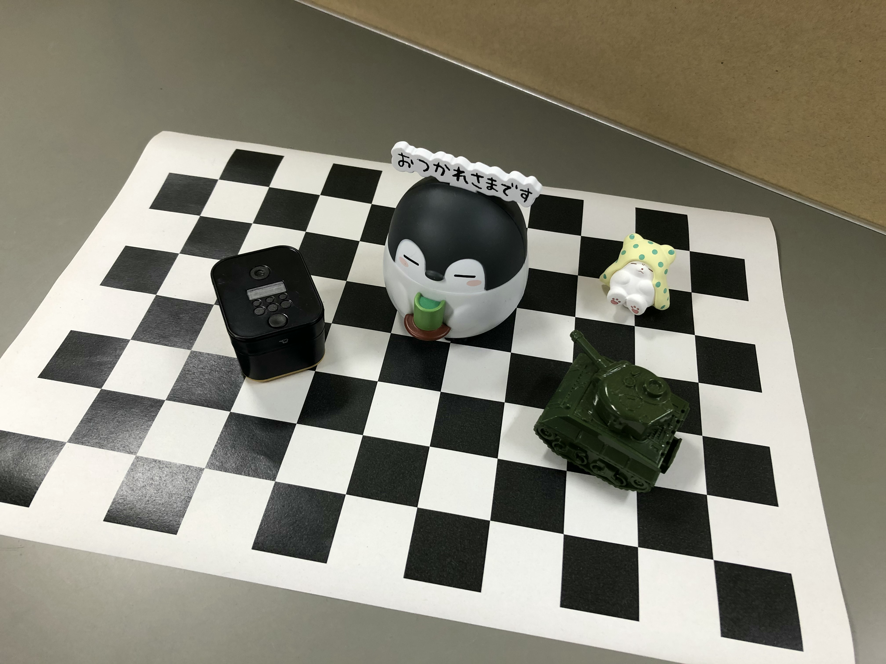
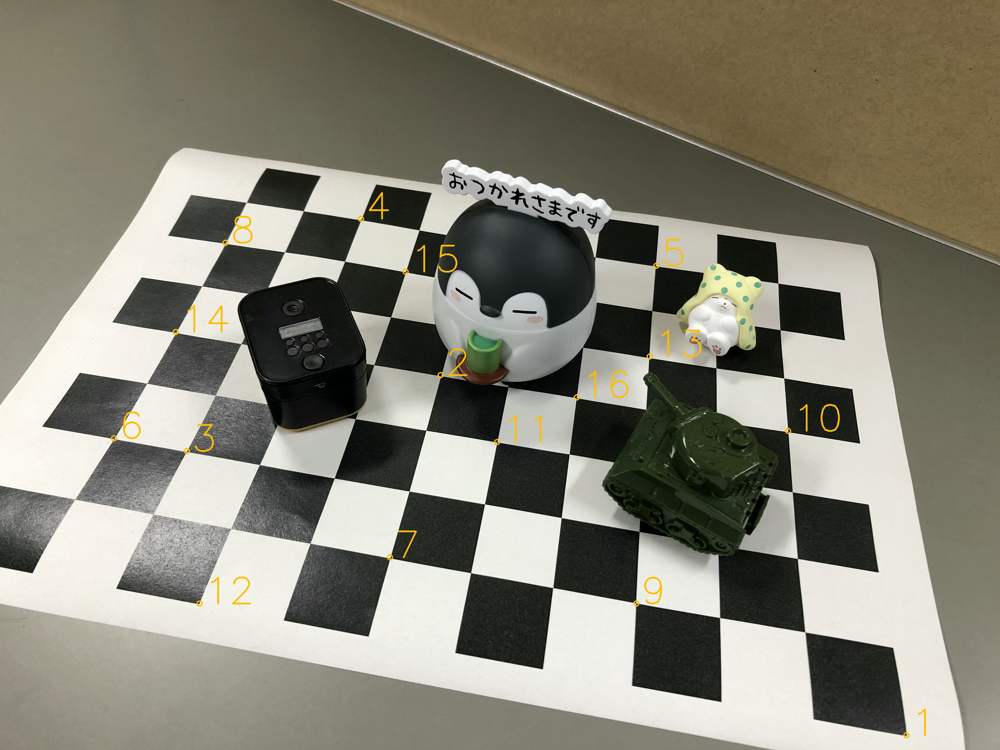

# 3D Information Processing
### Vision
Codes for the report; `Obtain a 3D shape from images taken by multiple cameras`

Origin of the name: Apple Framework [Vision](https://developer.apple.com/documentation/vision)

## Obtain a 3D shape from images taken by multiple cameras
- Obtain the perspective projection matrix for each cameras by camera calibration using a checkerboard.
- By using the obtained perspective projection matrix, calculate the 3D coordinates of the point from the 2D coordinates of the corresponding point between each image.

## Requirement
- numpy
- pandas
- OpenCV

Install OpenCV under Anaconda
```bash
conda install -c conda-forge opencv
```
https://anaconda.org/conda-forge/opencv

## Usage
#### Obtain the perspective projection matrix

```python
import pandas as pd
from camera import Camera

points = pd.read_csv('points.csv')
c = Camera(points)
c.calibrate()
    """
    Calibrate camera...
    Perspective Projection Matrix
    [[-4.01166202e+01  2.69309121e+01 -2.45286091e+01  1.58043293e+03]
     [ 9.16710285e+00  8.81454884e-01 -5.16736803e+01  1.10996705e+03]
     [-1.38215069e-02 -6.82164706e-03 -1.24927871e-02  1.00000000e+00]]
    """
```

sklearn-like
 ```python
import pandas as pd
from camera import Camera

points = pd.read_csv('points.csv')
c = Camera(points)
c.fit()
```

##### Format of `points.csv`
`u` and `v` are points of image

`x`, `y`, and `z` are points of object (checkerboard)

|   u  |   v  |   x  |   y  |  z  |
|:----:|:----:|:----:|:----:|:---:|
| 2117 | 1339 |  2.9 | 12.0 | 0.0 |
| 1593 | 1584 | 11.9 |  6.0 | 0.0 |
| 2199 | 2059 | 17.9 | 18.0 | 0.0 |

#### Projection

```python
x, y, z = 0.0, 11.1, 11.8
u, v = c.prespective_project(x, y, z)
    """
    u = 2046.5960184435
    v = 656.4871372556853
    """
```

sklearn-like
```python
x, y, z = 0.0, 11.1, 11.8
u, v = c.fit(x, y, z)  
```

#### Obtain 3D points from the perspective projection matrix of the calibrated camera

```python
import pandas as pd
from camera import Camera
from stereo import Stereo

# Calibrate camera
points1 = pd.read_csv("points1.csv")
points2 = pd.read_csv("points2.csv")

c1 = Camera(points1)
c2 = Camera(points2)
c1.calibrate()
c2.calibrate()

# stereo view
points12 = pd.read_csv("points1_2.csv")

s = Stereo(c1, c2, points12)
s.obtain_objects_points_by_stereo()
```

##### Format of `points1_2.csv`
`u1` and `v1` are points on the image used for calibration of c1

`u2` and `v2` are points on the image used for calibration of c2

|  u1  |  v1  |  u2  |  v2  |
|:----:|:----:|:----:|:----:|
| 1899 | 2483 | 1522 | 2171 |
| 1974 | 2453 | 1609 | 2155 |
| 2258 | 2331 | 1937 | 2079 |

#### Plot calibration points
```python
import pandas as pd
from visualize import plot_calibration_points

points = pd.read_csv("points.csv")
plot_calibration_points("sample/IMG_4047.JPG", "sample/IMG_4047_plotted.JPG", points)
```

Example

Original | Plotted
:-------:|:-------:
 | 